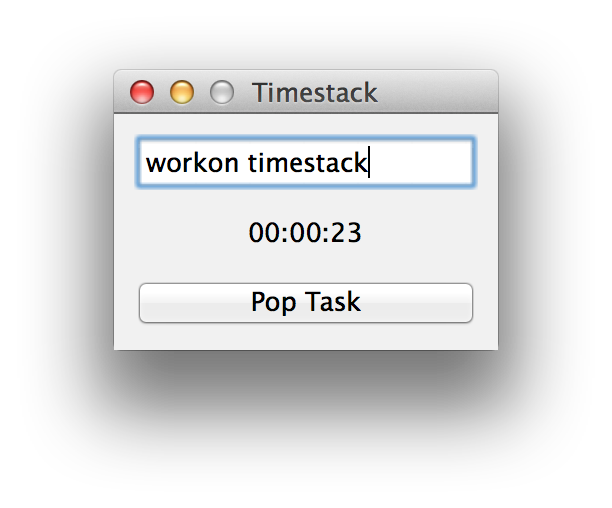

Timestack
=========

Stack based time management tool.

Inspired by [@xrath](https://twitter.com/xrath)'s [blog post](http://xrath.com/2012/05/time-management-based-on-stack/).

    $ pip install timestack
    $ timestack.py

App-ify on OS X using py2app

    $ python setup.py py2app

Exe-fy on Windows using py2exe

    $ python setup.py py2exe

Or download the prebuilt binary [here](https://github.com/limeburst/timestack/releases).
